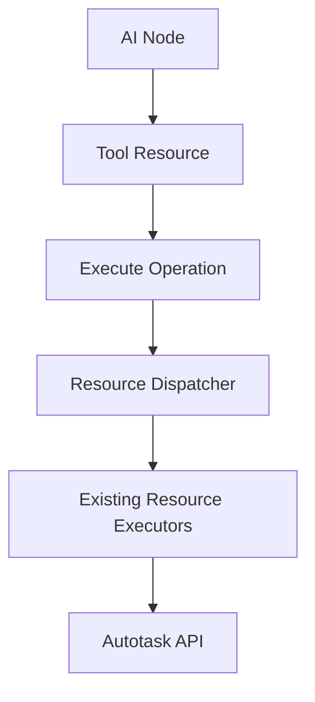

# AI Node Autotask Integration Design

## Overview

This design implements a simple "Tool" resource with an "Execute" operation for the n8n Autotask node. This allows AI nodes to dynamically select any Autotask resource and operation, with the tool handling field discovery and execution automatically.

## Architecture



### Core Components

| Component | Responsibility |
|-----------|--------------|
| **Tool Resource** | New resource type for AI integration |
| **Execute Operation** | Single operation that can execute any Autotask operation |
| **Resource Dispatcher** | Routes to existing resource execution functions |

## Tool Resource Implementation

### Resource Definition

Add to `RESOURCE_DEFINITIONS`:

```typescript
{
  name: 'Tool',
  value: 'tool',
  description: 'AI tool for dynamic Autotask operations execution',
}
```

### Tool Resource Fields

Following n8n patterns, the tool resource needs proper field definitions:

```typescript
export const toolFields: INodeProperties[] = [
  {
    displayName: 'Operation',
    name: 'operation',
    type: 'options',
    noDataExpression: true,
    displayOptions: {
      show: {
        resource: ['tool'],
      },
    },
    options: [
      {
        name: 'Execute',
        value: 'execute',
        description: 'Execute any Autotask operation dynamically',
        action: 'Execute Autotask operation',
      },
    ],
    default: 'execute',
  },
  {
    displayName: 'Target Resource',
    name: 'targetResource',
    type: 'options',
    required: true,
    displayOptions: {
      show: {
        resource: ['tool'],
        operation: ['execute'],
      },
    },
    typeOptions: {
      loadOptionsMethod: 'getQueryableEntities',
    },
    default: '',
    description: 'The Autotask resource to operate on',
  },
  {
    displayName: 'Resource Operation',
    name: 'resourceOperation',
    type: 'options',
    required: true,
    displayOptions: {
      show: {
        resource: ['tool'],
        operation: ['execute'],
      },
    },
    typeOptions: {
      loadOptionsMethod: 'getResourceOperations',
      loadOptionsDependsOn: ['targetResource'],
    },
    default: '',
    description: 'The operation to perform on the selected resource',
  },
  {
    displayName: 'Entity ID',
    name: 'entityId',
    type: 'string',
    displayOptions: {
      show: {
        resource: ['tool'],
        operation: ['execute'],
        resourceOperation: ['get', 'update', 'delete'],
      },
    },
    default: '',
    description: 'The ID of the entity (required for get, update, delete operations)',
  },
  {
    displayName: 'Fields',
    name: 'fieldsToMap',
    type: 'resourceMapper',
    default: {
      mappingMode: 'defineBelow',
      value: null,
    },
    displayOptions: {
      show: {
        resource: ['tool'],
        operation: ['execute'],
        resourceOperation: ['create', 'update', 'getMany', 'count'],
      },
    },
    typeOptions: {
      loadOptionsDependsOn: ['targetResource', 'resourceOperation'],
      resourceMapper: {
        resourceMapperMethod: 'getToolFields',
        mode: 'add',
        fieldWords: {
          singular: 'field',
          plural: 'fields',
        },
        addAllFields: false,
        multiKeyMatch: true,
        supportAutoMap: true,
      },
    },
  },
];
```

## Field Discovery

The tool resource leverages existing field discovery infrastructure following n8n patterns:

### Resource Selection

Reuse existing `getQueryableEntities()` method:

```typescript
// Already implemented in helpers/options/entityOptions.ts
// Provides dynamic list of all available Autotask resources
```

### Operation Selection

New load options method for dynamic operation discovery:

```typescript
// Add to Autotask.node.ts methods.loadOptions
async getResourceOperations(this: ILoadOptionsFunctions): Promise<INodePropertyOptions[]> {
  const targetResource = this.getNodeParameter('targetResource') as string;
  
  if (!targetResource) {
    return [];
  }
  
  // Map resource names to their operation definitions
  const RESOURCE_OPERATIONS_MAP = {
    ticket: ['create', 'get', 'getMany', 'update', 'count'],
    company: ['create', 'get', 'getMany', 'update', 'count'],
    contact: ['create', 'get', 'getMany', 'update', 'count'],
    timeEntry: ['create', 'get', 'getMany', 'update', 'delete', 'count'],
    // ... extracted from existing resource descriptions
  };
  
  const operations = RESOURCE_OPERATIONS_MAP[targetResource] || [];
  
  return operations.map(op => ({
    name: op.charAt(0).toUpperCase() + op.slice(1),
    value: op,
    description: `${op} operation for ${targetResource}`,
  }));
}
```

### Field Schema Discovery

New resource mapper method for tool fields:

```typescript
// Add to Autotask.node.ts methods.resourceMapping
async getToolFields(this: ILoadOptionsFunctions): Promise<ResourceMapperFields> {
  const targetResource = this.getNodeParameter('targetResource', 0) as string;
  const resourceOperation = this.getNodeParameter('resourceOperation', 0) as string;
  
  if (!targetResource) {
    return { fields: [] };
  }
  
  // Temporarily set resource parameter to get fields for target resource
  const originalGetNodeParameter = this.getNodeParameter;
  this.getNodeParameter = (name: string, index: number) => {
    if (name === 'resource') return targetResource;
    if (name === 'operation') return resourceOperation;
    return originalGetNodeParameter.call(this, name, index);
  };
  
  try {
    // Reuse existing getFields method
    return await getResourceMapperFields.call(this, targetResource);
  } finally {
    // Restore original method
    this.getNodeParameter = originalGetNodeParameter;
  }
}
```

## Validation

Reuse existing validation infrastructure:

```typescript
// Leverage existing field processors and validators
const processor = FieldProcessor.getInstance(resource, operation, context);
const validationResult = await processor.validateFields(fieldValues);
```

Validation happens through existing:
- Field type checking
- Required field validation  
- Business rule validation
- API constraint checking

## Execution Engine

### Parameter Context Manipulation

The key insight is that existing resource executors expect specific parameter names. The tool needs to manipulate the execution context:

```typescript
// In executeToolOperation function
export async function executeToolOperation(
  this: IExecuteFunctions,
): Promise<INodeExecutionData[][]> {
  const targetResource = this.getNodeParameter('targetResource', 0) as string;
  const resourceOperation = this.getNodeParameter('resourceOperation', 0) as string;
  const entityId = this.getNodeParameter('entityId', 0, '') as string;
  const fieldsToMap = this.getNodeParameter('fieldsToMap', 0, null);
  
  // Store original getNodeParameter method
  const originalGetNodeParameter = this.getNodeParameter;
  
  // Override getNodeParameter to return resource-specific values
  this.getNodeParameter = (name: string, index: number, fallbackValue?: any) => {
    switch (name) {
      case 'resource':
        return targetResource;
      case 'operation':
        return resourceOperation;
      case 'id':
        return entityId;
      case 'fieldsToMap':
        return fieldsToMap;
      default:
        return originalGetNodeParameter.call(this, name, index, fallbackValue);
    }
  };
  
  try {
    // Route to existing executor
    const executor = RESOURCE_EXECUTORS[targetResource];
    if (!executor) {
      throw new Error(`Resource ${targetResource} not supported`);
    }
    
    return await executor.call(this);
  } finally {
    // Restore original method
    this.getNodeParameter = originalGetNodeParameter;
  }
}
```

### Resource Executor Mapping

```typescript
// Import all existing executors and map them
const RESOURCE_EXECUTORS: Record<string, Function> = {
  aiHelper: executeAiHelperOperation,
  apiThreshold: executeApiThresholdOperation,
  ticket: executeTicketOperation,
  company: executeCompanyOperation,
  contact: executeContactOperation,
  timeEntry: executeTimeEntryOperation,
  // ... all 80+ existing executors
};
```

## Node Integration

### Adding Tool Resource to Main Node

Following the existing pattern in `Autotask.node.ts`:

```typescript
// Add to RESOURCE_DEFINITIONS import
// Add to properties array
properties: [
  {
    displayName: 'Resource',
    name: 'resource',
    type: 'options',
    noDataExpression: true,
    options: RESOURCE_DEFINITIONS, // Tool resource already added here
    default: '',
    required: true,
  },
  ...aiHelperFields,
  ...toolFields, // Add tool fields
  // ... existing resource fields
],

// Add to execute method switch statement
switch (resource) {
  case 'tool':
    return executeToolOperation.call(this);
  case 'aiHelper':
    return executeAiHelperOperation.call(this);
  // ... existing cases
}

// Add to methods.loadOptions
loadOptions: {
  getSelectColumns,
  getQueryableEntities,
  getEntityFields,
  getResourceOperations, // New method for tool
},

// Add to methods.resourceMapping
resourceMapping: {
  async getFields(this: ILoadOptionsFunctions): Promise<ResourceMapperFields> {
    return getResourceMapperFields.call(this, this.getNodeParameter('resource', 0) as string);
  },
  async getToolFields(this: ILoadOptionsFunctions): Promise<ResourceMapperFields> {
    // New method for tool field discovery
    return getToolResourceMapperFields.call(this);
  },
},
```

## Design Validation Against n8n Best Practices

### ✅ Alignment with n8n Patterns

**1. Resource-Operation Structure**
- ✅ Follows standard `resource` → `operation` → `parameters` hierarchy
- ✅ Uses `displayOptions.show` for conditional field display
- ✅ Implements proper `INodeProperties[]` field definitions

**2. Field Discovery Patterns**
- ✅ Uses `loadOptionsMethod` for dynamic dropdowns
- ✅ Implements `loadOptionsDependsOn` for cascading selections
- ✅ Follows `resourceMapper` pattern for field mapping
- ✅ Uses existing `getQueryableEntities` method

**3. Parameter Context Handling**
- ✅ Uses `getNodeParameter` method override pattern
- ✅ Properly restores original context after execution
- ✅ Maintains parameter isolation between resources

**4. Code Organization**
- ✅ Follows existing folder structure (`resources/tool/`)
- ✅ Separates description from execution logic
- ✅ Uses same import/export patterns as other resources

### ✅ Alignment with Autotask Node Structure

**1. Resource Integration**
- ✅ Integrates with existing `RESOURCE_DEFINITIONS`
- ✅ Follows same switch-case dispatch pattern
- ✅ Reuses all existing resource executors
- ✅ Leverages existing field discovery infrastructure

**2. Operation Compatibility**
- ✅ Compatible with all existing operation types
- ✅ Supports same field types (resourceMapper, options, string)
- ✅ Maintains existing validation patterns
- ✅ Preserves existing error handling

**3. AI Integration**
- ✅ Node already has `usableAsTool: true`
- ✅ Leverages existing AI Helper for field discovery
- ✅ Compatible with n8n's AI node requirements
- ✅ Provides dynamic operation selection for AI

### 🔧 Required Implementation Files

```
nodes/Autotask/resources/tool/
├── description.ts    # Tool field definitions
├── execute.ts        # Tool execution logic
└── index.ts         # Exports
```

### 📝 Integration Checklist

1. **Add Tool Resource Definition**
   - [ ] Add to `RESOURCE_DEFINITIONS` array
   - [ ] Create `toolFields` array following n8n patterns

2. **Implement Load Options Methods**
   - [ ] Add `getResourceOperations` to loadOptions
   - [ ] Add `getToolFields` to resourceMapping

3. **Create Tool Execution Logic**
   - [ ] Implement `executeToolOperation` function
   - [ ] Add parameter context manipulation
   - [ ] Map all existing resource executors

4. **Update Main Node**
   - [ ] Add tool case to execute switch
   - [ ] Add toolFields to properties array
   - [ ] Register new load options methods

This design is well-aligned with n8n best practices and the existing Autotask node architecture, requiring minimal changes while providing maximum functionality.

## Testing

### Unit Tests
- Tool resource field definitions
- Parameter context manipulation
- Resource executor mapping
- Load options methods

### Integration Tests  
- Tool execution with major resources (ticket, company, contact)
- Field discovery for different operation types
- Parameter validation and error handling
- AI node integration and discovery
